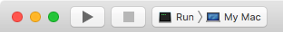

# [quickstart-bootstrap-blog][t]
[t]:https://github.com/VaporExamplesLab/quickstart-bootstrap-blog

<p align="center">
    <a href="http://docs.vapor.codes/3.0/">
        
    </a>
    <a href="LICENSE">
        
    </a>
    <a href="https://swift.org">
        
    </a>
</p>

<a id="toc"></a>
[Getting Started](#GettingStarted) •
[Original Setup](#OriginalSetup) •
[Resources](#Resources) 

## Getting Started <a id="GettingStarted">[▴](#toc)</a>

**Prerequisites**

* [Install Xcode 10 ⇗](https://itunes.apple.com/us/app/xcode/id497799835?mt=12)
* [Install homebrew ⇗](https://brew.sh/)
* [Install vapor toolbox ⇗](https://docs.vapor.codes/3.0/install/macos/)

**Download|Clone & Run**

Steps to download repository:

``` bash
## go to your working directory
cd <your-choosen-directory-path>

## download and unzip
wget https://github.com/VaporExamplesLab/quickstart-bootstrap-blog/archive/master.zip
unzip master.zip -d quickstart-bootstrap-blog
rm master.zip     # remove download

cd quickstart-bootstrap-blog-master

# update dependencies 
# with `-y` yes to generate and open Xcode project
vapor update -y
```

Or, alternate steps to clone repository instead of download:

``` bash
## go to your working directory
cd <your-choosen-directory-path>

## either clone
##    add --bare option for an unattached instance
git clone git@github.com:VaporExamplesLab/quickstart-bootstrap-blog.git 

cd quickstart-bootstrap-blog

# update dependencies 
# with `-y` yes to generate and open Xcode project
vapor update -y
```


``` bash
cd quickstart-bootstrap-blog
ln -s ../../blog_content_processed/public Public/blog 
ls -l Public
ls -l Public/blog/

ln -s ../../../blog_content_processed/leaf/m Resources/Views/blog_m 
ls -l Resources
ls -l Resources/Views
ls -l Resources/Views/blog_m/
```

Set Xcode scheme to "Run > My Mac".



Click the run button and check the results in a browser at `http://localhost:8080`.


## Original Setup <a id="OriginalSetup">[▴](#toc)</a>

The following steps were completed to create the `quickstart-bootstrap-blog` example. 


**Create Vapor Website Project**

Create a `quickstart-bootstrap-blog` project from the command line terminal:

``` bash
vapor new quickstart-bootstrap-blog --web
cd quickstart-bootstrap-blog
# add directory for README.md assets
mkdir README_files 
touch README_files/.git_keep # create file so folder is not empty for `git`  

# update dependencies 
# with `-y` yes to generate and open Xcode project
vapor update -y
```


## Resources <a id="Resources">[▴](#toc)</a>

* [Bootstrap ⇗](https://getbootstrap.com)
